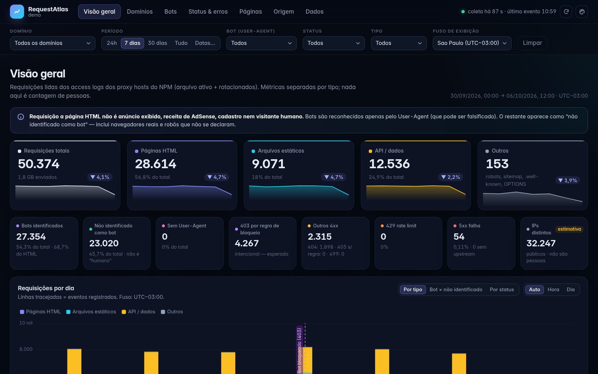
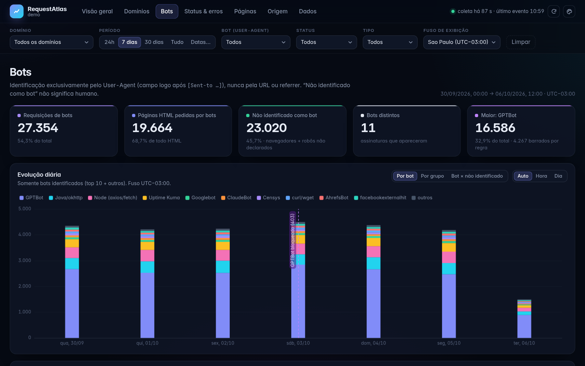
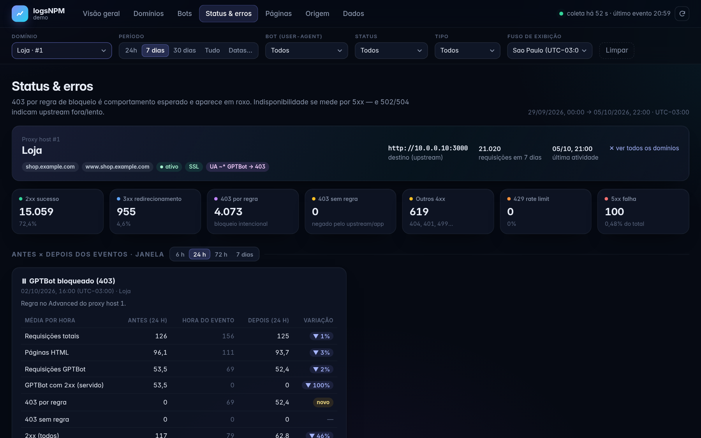
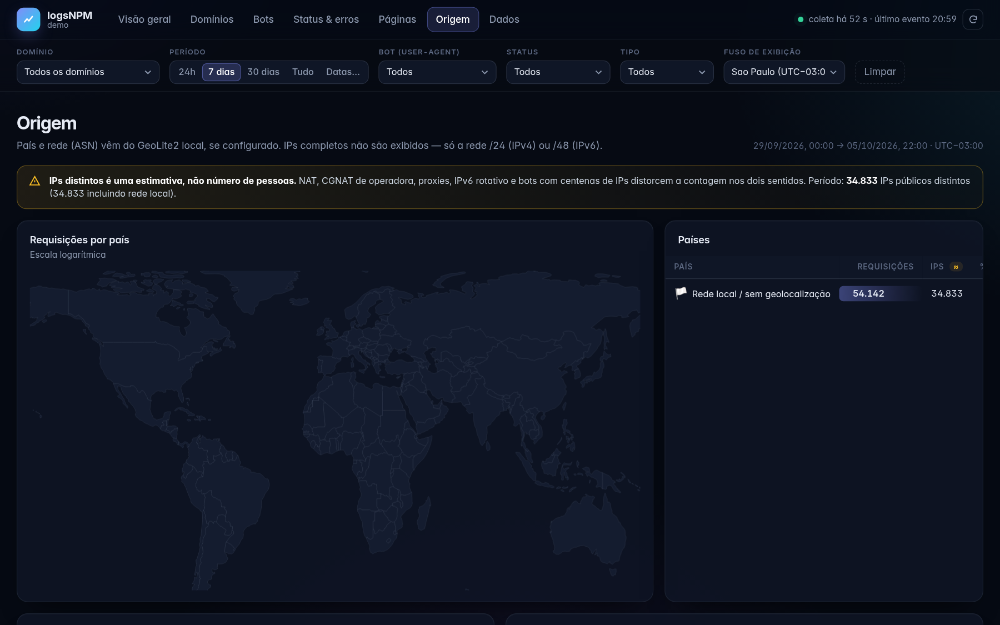
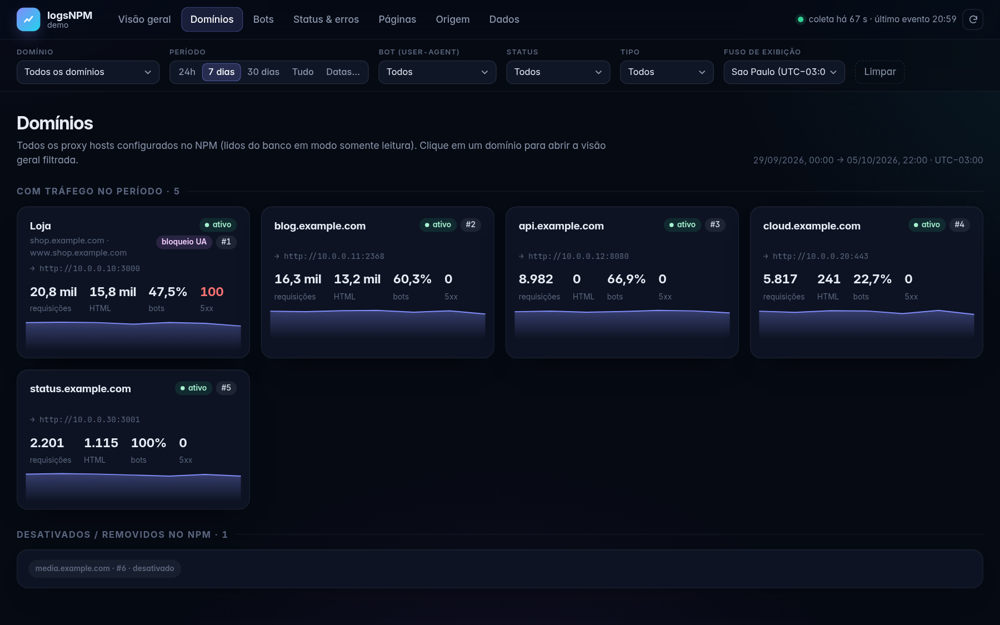

# logsNPM

[](https://github.com/Matheuscara/logsNPM/actions/workflows/ci.yml) [](https://github.com/Matheuscara/logsNPM/pkgs/container/logsnpm) [](LICENSE)

English · **[Português](README.md)**

**Understand the traffic reaching your Nginx Proxy Manager.** Separate HTML, static files and API calls; identify declared bots by User-Agent; and tell an intentional `403` block from an application error. No changes to NPM proxy hosts.



> Independent project, not affiliated with Nginx Proxy Manager. Screenshots use [generated sample data](scripts/gen_demo.py).

## Get started

### I run NPM with Docker

**Requirements:** Docker Compose v2.24+ and access to the directory NPM mounts at `/data`.

1. Get the files:

   ```sh
   git clone https://github.com/Matheuscara/logsNPM.git
   cd logsNPM
   cp .env.example .env
   mkdir -p config
   ```

2. In `.env`, set **`LOGSNPM_NPM_DATA`** to the *absolute* path of NPM's data directory. If NPM's Compose file says `./data:/data`, use the absolute path of that project's `./data`, for example `LOGSNPM_NPM_DATA=/srv/nginx-proxy-manager/data`.

3. Start the container:

   ```sh
   docker compose up -d
   docker compose ps
   ```

4. Open **<http://127.0.0.1:7881> on the Docker host**. From another machine, use an SSH tunnel (`ssh -L 7881:127.0.0.1:7881 user@host`) or [publish through NPM with HTTPS and access control](#publish-through-npm).

The first run reads existing logs; later cycles read only new lines. Country and ASN require optional GeoLite2 databases; everything else works without them.

### I want to try it without NPM

```sh
git clone https://github.com/Matheuscara/logsNPM.git
cd logsNPM
python3 scripts/gen_demo.py /tmp/logsnpm-demo
LOGSNPM_LANGUAGE=en python3 -m logsnpm serve --config /tmp/logsnpm-demo/logsnpm.toml
```

Open <http://127.0.0.1:7881>. This creates **fictional** logs, domains and a bot-block event.

<details>
<summary>More screenshots</summary>

| Bots | Status and blocks |
|---|---|
|  |  |

| Origin | Domains |
|---|---|
|  |  |

</details>

## What it shows

- **Overview:** total requests, HTML, static, API, identified bots, rule-based `403`, `429` and `5xx` — separately.
- **Domains and pages:** traffic per proxy host and top paths filtered by period, status, bot and type; CSV export.
- **Bots and origin:** top bots and hourly/daily trends; country, ASN, masked networks and referrers.
- **Status and data:** real failures vs expected blocks, before/after event comparisons and log-ingestion status.

**Important limit:** an HTML request is **not** a human visitor, ad impression, signup or revenue. “Not identified as bot” does **not** mean human. Distinct IPs are an **estimate**, not people; full IPs are not displayed.

## Make it yours

**Just trying colors?** Click **Appearance** (palette icon). Preview title, subtitle and colors **in your browser only**. To apply them for everyone, choose **Download TOML**, merge its keys into `config/logsnpm.toml`, and restart the container. The dashboard never writes server config.

**Permanent customization:** create `config/logsnpm.toml` using [`config.example.toml`](config.example.toml). For example:

```toml
[ui]
title = "My dashboard"
language = "en"
default_tz = "Europe/Berlin"
accent = ["#f97316", "#ec4899"]
pages = ["overview", "sites", "bots", "status", "pages"]

[sites.1]
name = "My shop"
api_prefixes = ["/api/"]
```

You can set branding, language, page order, colors, custom bots, URL classification, domains, events and privacy. [`config.example.toml`](config.example.toml) documents **all** keys; [`.env.example`](.env.example) documents Docker controls. Simple options also accept environment variables such as `LOGSNPM__UI__TITLE=My dashboard`.

> Changed bot or request classification? [Reprocess the logs](#reprocess-after-changing-rules). Appearance-only changes need just a restart.

## Before you expose it

Docker publishes the dashboard **only on `127.0.0.1`** by default. If you change `LOGSNPM_BIND` to a LAN IP or `0.0.0.0`, enable authentication; outside a trusted LAN, use HTTPS. Logs can reveal requested paths and access patterns.

logsNPM runs without root and mounts the required NPM files **read-only**. However, `database.sqlite` itself may contain sensitive information: protect the container and the dashboard. logsNPM's **own** database lives in a separate volume.

<details>
<summary>Set a username and password</summary>

In `.env`:

```dotenv
LOGSNPM_AUTH_USER=admin
LOGSNPM_AUTH_PASSWORD_FILE=/etc/logsnpm/password
# For LAN access: LOGSNPM_BIND=192.168.1.10
```

Create a password file readable by the container's UID (default `10001`):

```sh
openssl rand -base64 24 > config/password
sudo chown 10001:10001 config/password
sudo chmod 0400 config/password
docker compose up -d
```

Basic Auth over HTTP does not encrypt your password. Use HTTPS outside a trusted network. `/healthz` is the only unauthenticated endpoint; it responds only `ok` or `stale`.

</details>

<details>
<summary>Publish through NPM</summary>

1. In [`docker-compose.yml`](docker-compose.yml), uncomment the `networks` block and set NPM's Docker network (`docker network ls`).
2. Create an NPM Proxy Host pointing to `http://logsnpm:7881`, with **SSL and an Access List**. The host port may stay private on `127.0.0.1`.
3. If using `server.allow_networks` to filter visitors by real IP, set `trust_x_forwarded_for = true` **and** `trusted_proxy_networks = ["NPM_DOCKER_NETWORK_CIDR"]` under `[server]`. The config rejects trusted forwarding without a proxy network. It reads the header from right to left to ignore a client-forged IP.
4. Add the dashboard hostname to `ingest.exclude_hosts` to exclude its own traffic.

</details>

## Setup and operation reference

<details>
<summary>Docker mounts and image options</summary>

| Source | Purpose | logsNPM access |
|---|---|---|
| `LOGSNPM_NPM_DATA/logs` | Active and rotated NPM logs | Read-only |
| `LOGSNPM_NPM_DATA/database.sqlite` | NPM proxy-host names and Advanced rules | Read-only |
| `LOGSNPM_NPM_DATA/nginx` | Custom `geo` blocks, if present | Read-only |
| `LOGSNPM_DATA_VOLUME` | logsNPM aggregates | Write |
| `LOGSNPM_CONFIG_DIR` (default `./config`) | `logsnpm.toml` and password file | Read-only |

Only these NPM paths are mounted — not `keys.json`, `custom_ssl/` or `access/`. Logs, database and nginx paths must exist; Docker fails instead of silently creating them. Change the **host** port with `LOGSNPM_HOST_PORT`; the port inside the container remains `7881`.

`LOGSNPM_IMAGE` selects the image (default `ghcr.io/matheuscara/logsnpm:latest`). To build locally: set `LOGSNPM_IMAGE=logsnpm:local` and run `docker compose up -d --build`. Images support amd64 and arm64.

</details>

<details>
<summary>My NPM uses MySQL/MariaDB, not database.sqlite</summary>

In `.env`, set `LOGSNPM_NPM_DB_FILE=/dev/null`. **Log analysis still works.** Add hostnames and block rules to `config/logsnpm.toml` if you want them attributed:

```toml
[sites.1]
name = "My shop"
domains = ["shop.example.com", "www.shop.example.com"]
ua_rules = [{ pattern = "GPTBot", status = 403 }]
```

The ID `1` comes from `proxy-host-1_access.log`. Without NPM's SQLite, upstream target, SSL and enabled/removed state cannot be shown. With SQLite, an explicit `ua_rules` list **replaces** rules read from that site's Advanced config.

</details>

<details>
<summary>Permission errors reading NPM or writing aggregates</summary>

The container runs as `10001:10001` by default; `LOGSNPM_UID` and `LOGSNPM_GID` in `.env` can change it. It must read NPM logs and `database.sqlite` and write to `LOGSNPM_DATA_VOLUME`.

- Cannot read logs: grant the chosen UID/GID access, including default ACLs on the log directory for future rotations.
- Changed UID/GID: prepare a writable host directory (e.g. `mkdir -p data && sudo chown 1000:1000 data` with `LOGSNPM_DATA_VOLUME=./data`) or change the owner of the existing Docker volume.
- `config/logsnpm.toml` and `config/password` must be readable by that UID.

Check `docker compose logs logsnpm` and `docker compose exec logsnpm python -m logsnpm check`. See [`.env.example`](.env.example) for paths and IDs.

</details>

<details>
<summary>Native installation, without Docker</summary>

Requires Python 3.11+ on a host/LXC that can read NPM logs:

```sh
git clone https://github.com/Matheuscara/logsNPM /opt/logsnpm
mkdir -p /etc/logsnpm
cp /opt/logsnpm/config.example.toml /etc/logsnpm/logsnpm.toml
# Edit paths in the TOML before continuing.
cd /opt/logsnpm
LOGSNPM_CONFIG=/etc/logsnpm/logsnpm.toml python3 -m logsnpm check
cp deploy/logsnpm.service /etc/systemd/system/
systemctl enable --now logsnpm
```

Outside Docker, `server.listen` defaults to `127.0.0.1`. Use auth and an HTTPS reverse proxy before exposing it. See [`deploy/nginx-npm-custom-http.conf`](deploy/nginx-npm-custom-http.conf).

</details>

<details>
<summary>Environment variables and precedence</summary>

Precedence: **defaults → `logsnpm.toml` → `LOGSNPM_*` shortcuts → `LOGSNPM__SECTION__KEY`**. `LOGSNPM_AUTH_PASSWORD_FILE` fills the password last and cannot coexist with another password. Unknown or mistyped options stop startup with an error.

Examples in `.env`:

```dotenv
LOGSNPM__UI__TITLE=My proxy dashboard
LOGSNPM__UI__SHOW_CAVEATS=false
LOGSNPM__UI__ACCENT='["#f97316", "#facc15"]'
LOGSNPM__UI__PAGES='["overview", "bots", "pages"]'
LOGSNPM__SITES__1__NAME=My shop
LOGSNPM__EVENTS__ITEMS='[{"ts":"2026-10-05T10:06:16-03:00","title":"Blocked GPTBot","site":1}]'
```

Values use JSON for numbers, booleans, arrays and tables; plain text also works. An array/table from the environment **replaces** the TOML value. The same `.env` controls `LOGSNPM_BIND`, `LOGSNPM_HOST_PORT`, `LOGSNPM_UID` and `LOGSNPM_GID` for Compose. See [`.env.example`](.env.example) for all options.

</details>

### Reprocess after changing rules

Changes to `[bots]`, `[classify]`, `[privacy]`, `ingest.exclude_hosts` or `sites.*.api_*/ua_rules` do not retroactively alter old aggregates. To reclassify all available history:

```sh
docker compose stop logsnpm
docker compose run --rm logsnpm reindex
docker compose start logsnpm
```

The dashboard warns when reindexing is needed. **Never run two ingesters concurrently.** Title and color changes do not require reindexing.

<details>
<summary>How are numbers calculated?</summary>

logsNPM reads `proxy-host-N_access.log` and rotated `.N.gz` files incrementally. It identifies files by first line; the offset and aggregates commit together to SQLite, preventing double counts after restarts or rotation. User-Agent comes from the field right after `[Sent-to …]`, never the URL or referrer. Results are bucketed hourly in UTC and displayed in your chosen time zone. NPM database and config are opened read-only.

`python -m logsnpm serve` runs UI and collector; `ingest` reads one cycle; `check` validates paths/config; `reindex` rebuilds aggregates. For development run `python -m unittest discover -s tests`.

</details>

## License

MIT. Third-party licenses: [`logsnpm/web/vendor/LICENSES.md`](logsnpm/web/vendor/LICENSES.md). The GeoLite2 database is **not** bundled; bring your own under MaxMind's license.
